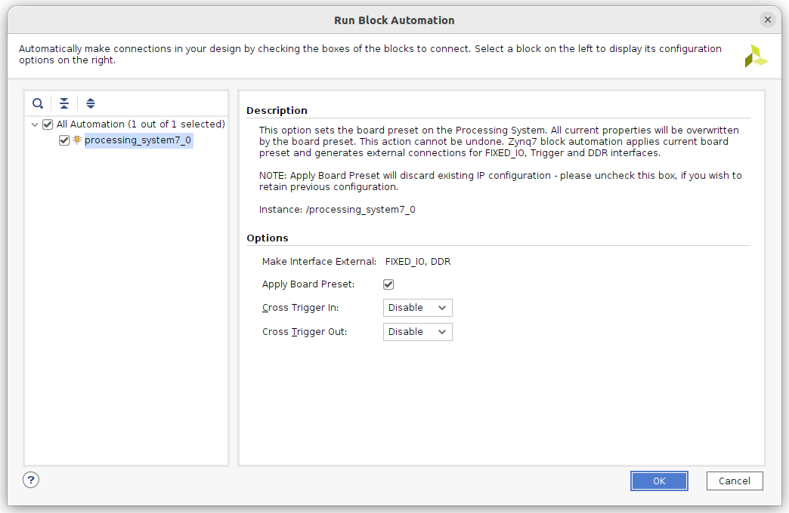
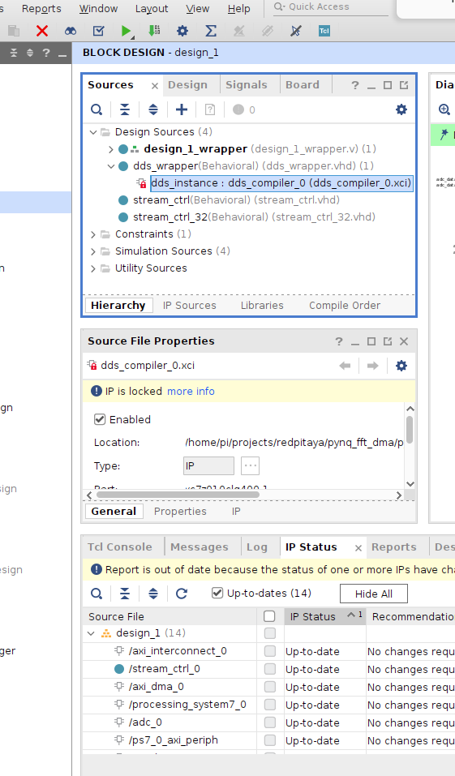

```
aaaa
```
$$
\sum_{i=0}^{10}x_i
$$
New project


add project name and directory

Choose project type

Add source (Skip)

Add constraints


Choose board

The Vivado window for the project


Create a block design


Right-click on the blank design and select Add IP to instantiate:

ZYNQ 7 Processing System

AXI GPIO (we will use this IP to write from PS to PL)


Run block automation




After creating a new project, we have to add the IP repository that has been created to simplify the use of analog frontends of the Redpitaya-125-14:

Go to the left panel click on Project Manager --> Settings.
Navigate to IP --> Repository.
Add the repository FPGA-Notes-for-Scientists/ip.


Create an instance of the following IPs:

ZYNQ7 Processing System
Processor System Reset
AXI GPIO
AXI Interconnect (x2)
AXI Direct Memory Access (x2)
Redpitaya-125-14-clk
Redpitaya-125-14-adc
Redpitaya-125-14-dac


Double click on the ZYNQ7 instance and go to PS-PL Configuration --> HP Slave AXI Interface and enable the high performance interfaces HP0 and HP1 (data width 64 bit).


Connect all clocks and resets


## Connect all ports

- Edit the constraints in redpitaya-125-14.xdc and uncomment the sections:

ADC (lines 8-56)

DAC (lines 59-90)

Clock constraints (lines 180-183)

- Go back to your design and create the required input/output ports for the Redpitaya-125-14-clk, Redpitaya-125-14-adc and Redpitaya-125-14-dac IPs. The fastest way is to right-click on a every port and choose Create Port (CTRL + K) and proceed with the default settings.

- Including all the required ports, the design becomes:


Connect AXI_interconnect to the processor HP port


add stream control to the project

16bit

32bit


add stream modules into the project

16 Bit


32 Bit


Connect stream control to ADC and connect clk and reset


We need a way to set parameter in the PL. We will use register bank

we need one for triger and one for numner of samples in stream control. 


then we connect the register outoput to both stream controls


Validate Design


There are 3 unconnected ports. Two are in axi_dma and another one is DAC.

Firat, we creat HDL Wrapper


we need data for DAC. We will use DDS with some parameters. In order to include DDS into the project we will use DDS wrapper. 

First, add these two source files


We observe that the dds ip is in lock status. We need to upgrade this using `Report IP Status`



Add DDS wrapper to the project


We observe that the DDS wrapper need to parameters. We need to add therse parameters into the register so that we can set them from python script


We can now connect them to the DDS Wrapper and connect the clock as well.


We then connect the DDS Wrapper output to DAC,


Verify the connection


Add FFT and set the FFT IP

Set Target frequency and bit rate and Transform length to 8192

Set Natural order and add reset


Click Run connection automation


Click run connecttion automation


